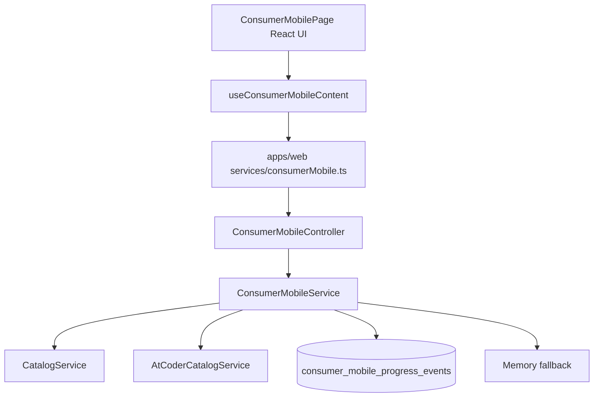
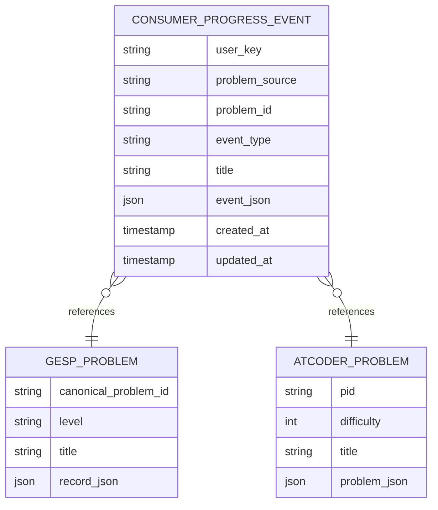

# 架构设计

## 总体方案

本次重构采用「后端页面级聚合模型 + 前端薄渲染组件」方案。后端 `ConsumerMobileService` 继续消费现有 GESP/AtCoder catalog service 和 progress events，但新增或扩展 C 端 View Model，直接返回首页、进度、我的页面需要的数据结构。前端围绕 5 个页面状态拆分组件，避免页面层跨多个接口手工拼装。



## 组件职责

| 组件 | 职责 |
|---|---|
| `ConsumerMobilePage` | 移动 shell、当前 view、底部导航、页面容器 |
| `consumer/mobile components` | Home、Catalog、Problem、Progress、Profile 页面组件 |
| `useConsumerMobileContent` | 数据加载、缓存、题目选择、事件写入 |
| `consumerMobile.ts` | API client、user key header、请求参数编码 |
| `ConsumerMobileController` | REST API 边界、query/body/header 提取 |
| `ConsumerMobileService` | 页面级聚合、目录转换、progress events、fallback |
| MySQL progress table | 用户行为持久化 |

## API 设计

### 保留接口

- `GET /consumer-mobile`
- `GET /consumer-mobile/gesp/catalog`
- `GET /consumer-mobile/gesp/problems/:id`
- `GET /consumer-mobile/atcoder/catalog`
- `GET /consumer-mobile/atcoder/problems/:id`
- `GET /consumer-mobile/progress`
- `POST /consumer-mobile/progress/events`

### 建议增强

`GET /consumer-mobile` SHOULD 返回扩展模型：

```ts
type ConsumerMobilePageModel = {
  generated_at: string;
  data_source: { gesp: string; atcoder: unknown; progress: "mysql" | "memory" };
  home: {
    today_task: LearningTask | null;
    continue_task: LearningTask | null;
    library_cards: Array<{ source: "gesp" | "atcoder"; title: string; count: number; subtitle: string }>;
    knowledge_progress: WeakPoint[];
  };
  catalog_summary: {
    default_level: number;
    levels: LevelSummary[];
    atcoder_total_count: number;
  };
  progress_summary: ProgressSummary;
  profile_summary: ProfileSummary;
  legacy: ConsumerMobileContent;
};
```

`GET /consumer-mobile/progress` SHOULD 返回：

```ts
type MobileProgress = {
  data_source: "mysql" | "memory";
  user_key: string;
  counts: { viewed: number; favorite: number; reviewed: number; weekly_actions: number };
  mastery_pct: number;
  viewed: StoredProgressEvent[];
  favorites: StoredProgressEvent[];
  reviewed: StoredProgressEvent[];
  weak_points: WeakPoint[];
  recent_events: StoredProgressEvent[];
  review_plan: ReviewPlan;
};
```

## 数据模型



## 学习事件状态机

```text
unseen
  | view
  v
viewed
  | favorite
  v
favorited
  | review
  v
reviewed

viewed -- review --> reviewed
favorited -- view --> favorited
reviewed -- favorite --> reviewed + favorited
```

| 当前状态 | 事件 | 结果 | 说明 |
|---|---|---|---|
| unseen | view | viewed | 打开题目自动记录 |
| viewed | favorite | viewed + favorited | 收藏不删除浏览记录 |
| viewed | review | viewed + reviewed | 可直接标记复习 |
| favorited | review | favorited + reviewed | 收藏题进入复习闭环 |
| any | duplicate event | unchanged updated_at refresh | 幂等写入 |

## 配置模型

| 配置 | 类型 | 默认值 | 约束 |
|---|---|---|---|
| `MYSQL_HOST` | string | `127.0.0.1` | MySQL host |
| `MYSQL_PORT` | number | `3310` | MySQL port |
| `MYSQL_DATABASE` | string | `gesp_catalog` | database |
| `MYSQL_USER` | string | `gesp` | user |
| `MYSQL_PASSWORD` | string | `gesp_dev_password` | 不得暴露给前端 |
| `CONSUMER_DEFAULT_LEVEL` | number | `5` | 可选新增，1-8 |
| `CONSUMER_REVIEW_PLAN_SIZE` | number | `3` | 可选新增，1-5 |
| `CONSUMER_CATALOG_LIMIT` | number | `80` | 可选新增，20-100 |

## 错误处理

| 错误类型 | 组件 | 处理 |
|---|---|---|
| MySQL 连接失败 | ConsumerMobileService | warn log，fallback memory，返回 `data_source: memory` |
| 非法 event body | Controller/Service | 400 BadRequest 或标准化到 view，必须测试固定 |
| 题目不存在 | Service | 返回 null，前端展示空状态 |
| catalog 数据为空 | Service/UI | 返回空数组和默认说明 |
| 题面/代码缺失 | UI | 展示暂无题面/暂无代码，不阻断其他操作 |

## Observability

### Metrics

- `consumer_mobile_home_request_duration_ms`
- `consumer_mobile_progress_request_duration_ms`
- `consumer_mobile_progress_write_total`
- `consumer_mobile_progress_fallback_total`
- `consumer_mobile_catalog_filter_count`
- `consumer_mobile_empty_state_total`

### Structured Logs

- `consumer_mobile.progress.mysql_fallback`
- `consumer_mobile.progress.event_recorded`
- `consumer_mobile.catalog.empty`
- `consumer_mobile.problem.not_found`
- `consumer_mobile.page_model.generated`

### Health Checks

- API process health。
- MySQL progress schema readiness。
- GESP catalog load availability。
- AtCoder catalog load availability。

## ADR 列表

- [ADR-001 页面级聚合模型](ADR-001-page-level-view-model.md)
- [ADR-002 保留并增强现有 REST 接口](ADR-002-extend-existing-rest-contract.md)
- [ADR-003 使用事件表驱动进度和复习](ADR-003-progress-event-store.md)
- [ADR-004 用截图和契约测试约束重构质量](ADR-004-contract-visual-validation.md)
