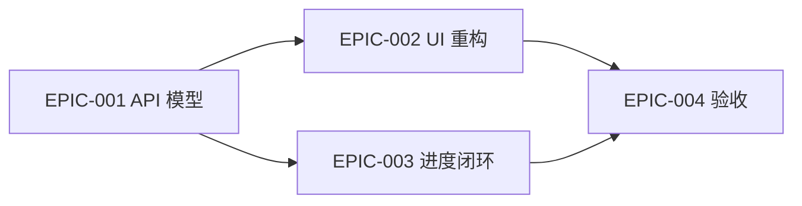

# Epics 与执行计划

## Epic 总览

| Epic | 标题 | MVP | 依赖 | 覆盖需求 |
|---|---|---:|---|---|
| EPIC-001 | 后端页面级模型与 API 修复 | 是 | 无 | REQ-006, REQ-001, REQ-004, REQ-005 |
| EPIC-002 | 5 屏移动 UI 重构 | 是 | EPIC-001 可并行 mock | REQ-001~REQ-005, NFR-USABILITY-001 |
| EPIC-003 | 学习进度、收藏和复习闭环 | 是 | EPIC-001 | REQ-003~REQ-005 |
| EPIC-004 | 验证、截图和交付收尾 | 是 | EPIC-001~003 | NFR-TEST-001, NFR-PERF-001, NFR-RELIABILITY-001 |

## 依赖图

## 推荐执行顺序

1. EPIC-001：先稳定 Consumer Mobile API 合同，让 UI 能消费真实数据。
2. EPIC-002：按原型拆分页面组件和 CSS token，完成 5 屏视觉。
3. EPIC-003：打通收藏、复习、最近动作、复习计划的闭环。
4. EPIC-004：补验证脚本、截图、build 和回归修复。

## MVP Definition of Done

- `GET /consumer-mobile` 和 `GET /consumer-mobile/progress` 返回 PRD 要求字段。
- 5 个移动 view 与原型主要布局一致。
- 收藏、浏览、复习事件能驱动进度和我的页变化。
- API 验证、web build、移动端截图验收通过。
- 不破坏管理端现有页面。

## Traceability

| Requirement | Epic |
|---|---|
| REQ-001 | EPIC-001, EPIC-002 |
| REQ-002 | EPIC-001, EPIC-002 |
| REQ-003 | EPIC-002, EPIC-003 |
| REQ-004 | EPIC-001, EPIC-003 |
| REQ-005 | EPIC-001, EPIC-003 |
| REQ-006 | EPIC-001 |
| NFR-USABILITY-001 | EPIC-002, EPIC-004 |
| NFR-PERF-001 | EPIC-001, EPIC-004 |
| NFR-RELIABILITY-001 | EPIC-001, EPIC-004 |
| NFR-TEST-001 | EPIC-004 |
