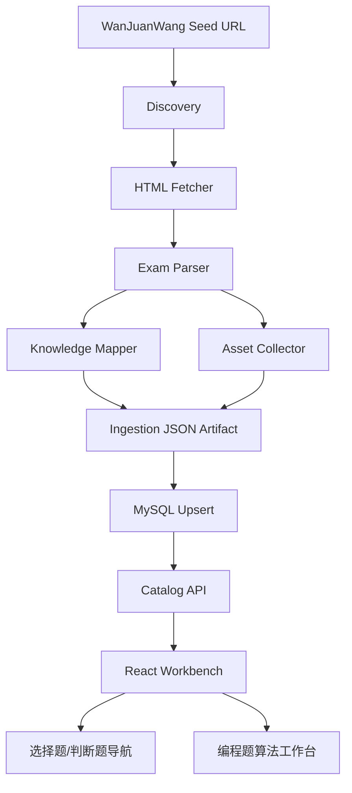
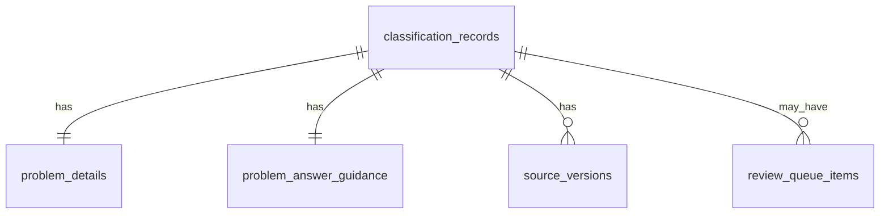

# Architecture Overview

## Components



## Technology Stack

- Crawler：Node.js script using `fetch` and an HTML parser.
- Fallback crawler：Python only if Node parsing cannot handle malformed HTML.
- API：existing NestJS `CatalogService` with query/filter extension.
- Database：existing MySQL schema, using JSON columns for WanJuanWang-specific metadata.
- Frontend：React + Ant Design + lucide-react.

## Data Model



## State Machine

```text
configured -> discovered -> fetched -> parsed -> classified -> artifact_written -> persisted -> reviewed
                  |           |          |             |              |
                  v           v          v             v              v
                failed      failed   partial_parse  needs_review   rollbackable
```

| State | Transition | Output |
| --- | --- | --- |
| configured | seed URL accepted | run config |
| discovered | level URLs accepted | page manifest |
| fetched | HTTP ok | HTML snapshot metadata |
| parsed | section parser complete | question records |
| classified | mapper complete | tags with evidence |
| artifact_written | JSON saved | replayable artifact |
| persisted | transaction committed | DB records |
| reviewed | manual decisions | status changes |

## Configuration Model

| Field | Type | Default | Constraint |
| --- | --- | --- | --- |
| `seedUrl` | string | required | `https://www.wanjuanwang.com/kjjs/*.html` |
| `levelUrls` | string[] | [] | optional allowlist |
| `session` | string | inferred | e.g. `2025-06` |
| `language` | string | `C++` | current scope only |
| `levels` | number[] | `[1,2,3,4,5,6,7,8]` | 1-8 |
| `writeJson` | boolean | true | required before DB |
| `writeDb` | boolean | false | opt-in |
| `downloadImages` | boolean | true | may store remote-only on failure |
| `htmlConcurrency` | number | 2 | 1-4 |
| `imageConcurrency` | number | 4 | 1-8 |

## Error Handling

| Component | Error Class | Handling |
| --- | --- | --- |
| Discovery | no level URL | fail run unless allowlist covers missing levels |
| Fetcher | transient HTTP/network | retry then mark page failed |
| Parser | missing section/question fields | partial record + review item |
| Asset Collector | image download failure | keep remote URL + pending status |
| Mapper | ambiguous classification | candidate tags + review item |
| Persistence | transaction failure | rollback DB transaction, keep JSON artifact |

## Observability

Metrics:

- `wanjuan_discovered_pages_total`
- `wanjuan_questions_parsed_total`
- `wanjuan_questions_by_level_type`
- `wanjuan_parse_failures_total`
- `wanjuan_assets_failed_total`
- `wanjuan_db_inserted_total`
- `wanjuan_db_updated_total`

Structured events:

- `discovery.page.accepted`
- `fetch.page.completed`
- `parse.question.completed`
- `classify.question.completed`
- `db.upsert.completed`
- `review.item.created`

## ADRs

- ADR-001：Use explicit allowlist plus related-link discovery
- ADR-002：Reuse existing catalog JSON shapes and MySQL tables
- ADR-003：Treat WanJuanWang as review-required third-party source
- ADR-004：Classify programming questions into existing algorithm domains
- ADR-005：Implement selection/judgment as filtered catalog views
