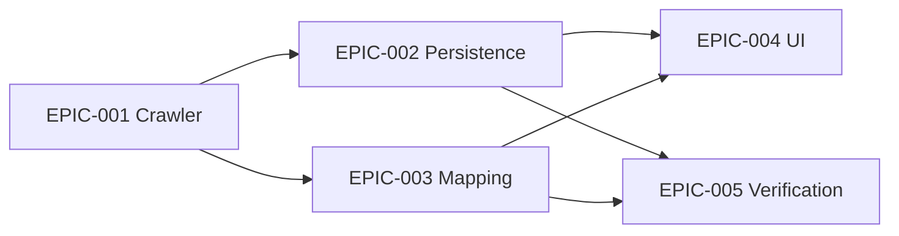

# Epics Index

## Epic Table

| ID | Title | MVP | Requirements |
| --- | --- | --- | --- |
| EPIC-001 | Crawler discovery and parser | Yes | REQ-001, REQ-002, NFR-PERF-001 |
| EPIC-002 | Persistence and source provenance | Yes | REQ-003, REQ-007, NFR-SEC-001 |
| EPIC-003 | Knowledge mapping and review | Yes | REQ-004, REQ-007 |
| EPIC-004 | Question type navigation and workbench integration | Yes | REQ-005, REQ-006 |
| EPIC-005 | Verification, dry-run and rollback | Yes | NFR-OPS-001, REQ-007 |

## Dependency Map

## Recommended Execution Order

1. EPIC-001：先拿到稳定 JSON artifact。
2. EPIC-002：把 artifact 幂等写入 MySQL。
3. EPIC-003：接入知识点、算法范畴和复核队列。
4. EPIC-004：开放选择题/判断题导航和编程题工作台展示。
5. EPIC-005：补齐 dry-run、验收脚本和回滚报告。

## MVP Definition of Done

- 8 个等级页面全部发现或有显式跳过理由。
- 题目数按等级和题型与页面统计一致。
- MySQL 中可查询新题并通过现有 API 返回。
- 前端左侧可进入选择题和判断题，编程题可在工作台对应算法位置出现。
- 所有第三方来源均有 source_versions 和 review 状态。
